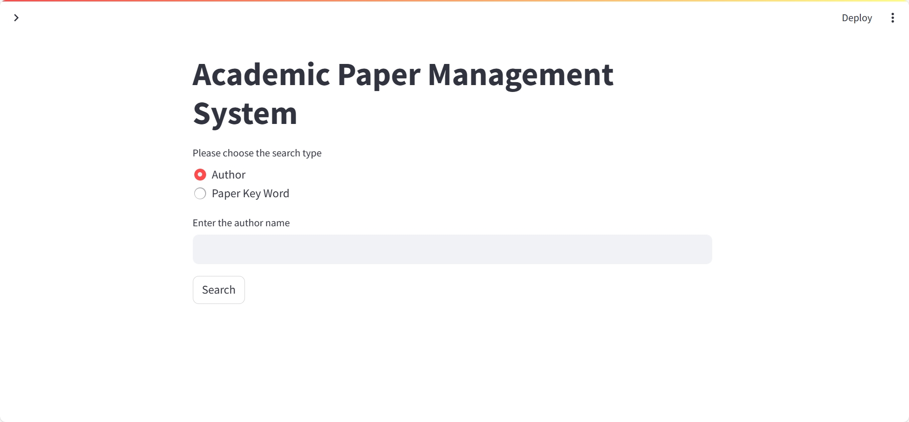
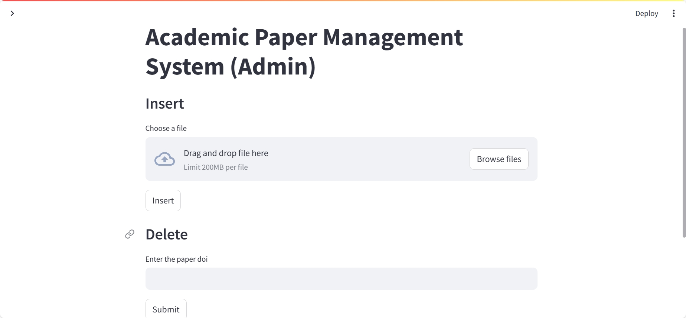

# CSC3170_Project_Academic-Paper_Management

## ⚡ Introduction
The exponential growth of scholarly literature has created challenges in managing and accessing vast academic resources, prompting the need for improved systems. While platforms like Google Scholar and arXiv have been beneficial, their centralized nature lacks personalized user control. This project aims to address these issues by developing a personalized academic paper management system. It emphasizes user autonomy, offering a database where users can efficiently search and organize papers by keywords or authors, providing comprehensive information and facilitating a deeper understanding of an author's contributions. The focus isn't on creating a massive database like Google Scholar, but rather on enabling individuals to manage their resources effectively. By prioritizing user autonomy and streamlined organization, the system intends to transform how researchers interact with academic literature, fostering a more inclusive and user-driven academic ecosystem. Ultimately, the project aims to create a user-centric Academic Paper Management System that caters to individual research needs, aiming for a satisfying and personalized user experience while overcoming existing limitations in academic paper management.

## 📕 Database
The direct directory `database` contains the data and SQL codes to create the database. You can create the database:

1️⃣ run the `SQLQuery.sql`

2️⃣ run the script `data_transfer.ipynb`

## ⏳ Back-end
The back-end server is achieved with the help of python fastapi framework. Load the back-end server:
```
cd back-end
uvicorn server:app --reload
```

## 📺 Front-end
Load the webpage:
```
cd ../front-end
streamlit run combinev1.py
```

Simplified demo:



